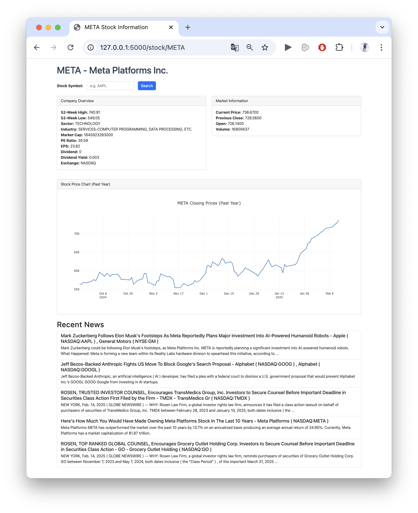

# Stock Info

A Flask-based web application that displays stock information.

## Overview

This application allows users to look up stock details by entering a stock symbol. It retrieves real-time and historical stock data using the **Alpha Vantage API** and presents it in a user-friendly interface with Bootstrap styling.

## Features

- Search for stock information by entering a stock symbol.
- Display company details such as sector, industry, market cap, and exchange.
- Show real-time stock prices, historical data, and key financial metrics.
- Interactive stock price chart using **Plotly**.
- Handles invalid stock symbols with user-friendly alerts.
- Responsive design with **Bootstrap** for better UI experience.

## Screenshot



## Installation Notes

Don't forget to set up the **Alpha Vantage API key** in the environment variable to fetch stock data. You can either create a `.env` file in the project root or export it manually in your terminal.


```
ALPHAVANTAGE_API_KEY=your_api_key_here
```
